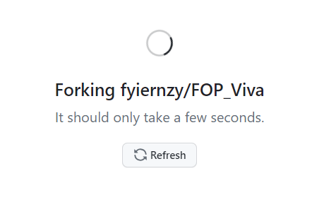
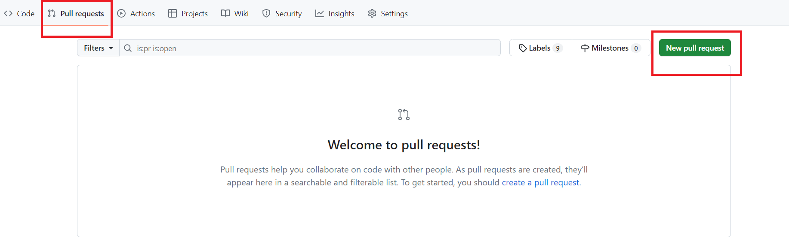
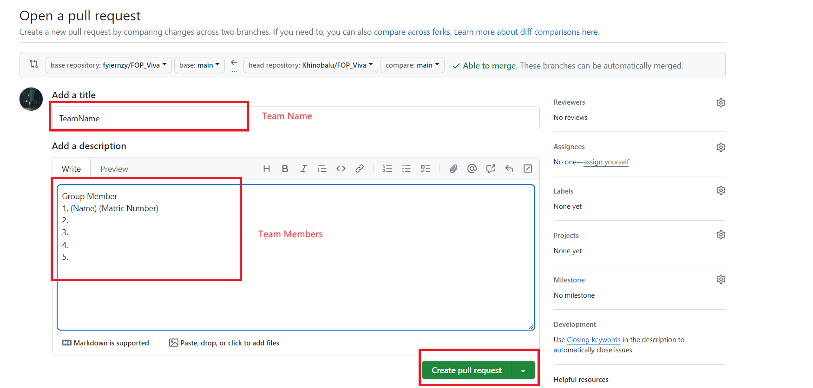

# FOP_Viva

🌱 This repository is used for Viva evaluation, employing Java to perform automatic assessments on WIX1002 (Fundamentals of Programming).

## Guidance

During the Viva presentation:

1. The demo will instruct each team to make necessary changes to adapt their code to the requirements.
2. Each team will be given 10 minutes to modify their code; afterward, the demos will begin the evaluation.
3. If a team hasn't pushed the code to the forked repository and requested pull requests, the entire team will receive a score of 0. Remember to create the folder using your team name as the folder name.
4. Each team must submit their script following the template provided in '2323/Viva_'.
5. The demos will pull the script and perform evaluations from the demo's terminal.
6. Each team will be given one chance if any tests fail. **Challenges are allowed**.
7. After the code evaluation, the demo will randomly select someone from the team to explain the questions.
8. There should be no sharing of questions or code changes asked by the demos with other groups. If such behavior is caught, the whole team's scores will be halved, including the one who shared and the one who requested to share.

## How to Fork the Repository

1. Visit the [repository](https://github.com/fyiernzy/FOP_Viva).
2. Locate and click the "Fork" button, as shown in the image below:
   
3. Click on the "Create Fork" button.
   
4. Please be patient and wait.
   
5. You will now see a page identical to the [original repository](https://github.com/fyiernzy/FOP_Viva), but with a different owner.
   
6. Use `git clone` to copy the forked repository to your local machine. Make any necessary changes, which will not be covered here as it has been previously explained.
   
7. Click on "Pull Request" -> "New Pull Request" or "Contribute" -> "Open Pull Request."
   
   
8. Select "Create New Pull Request."
   
9. Modify the title to your team name, enter your teammates' names and matriculation numbers in the description, then click "Create Pull Request."
   
10. You have successfully pushed your team's code if you see the following page.
    
