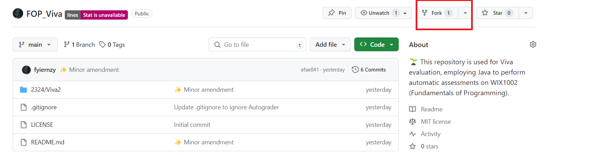
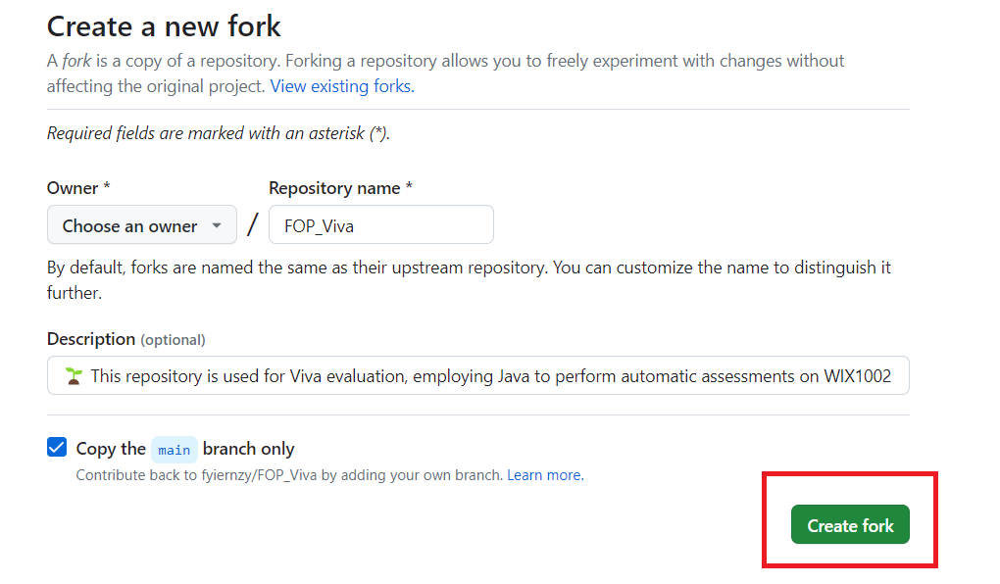
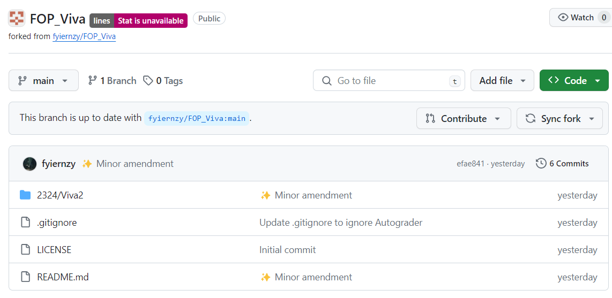
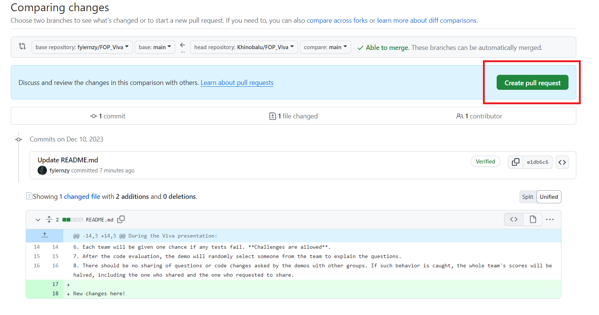
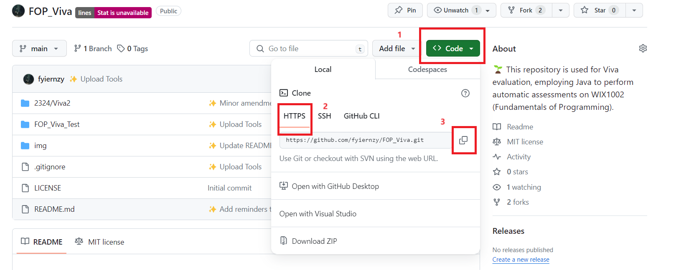
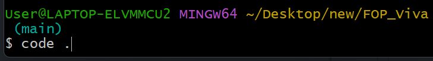
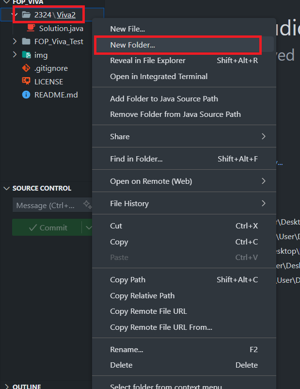

# FOP_Viva

🌱 This repository is used for Viva evaluation, employing Java to perform automatic assessments on WIX1002 (Fundamentals of Programming).

This README.md contains three sections, which are:
1. [Guidance](https://github.com/fyiernzy/FOP_Viva?tab=readme-ov-file#guidance)
2. [How to Push a New File](https://github.com/fyiernzy/FOP_Viva?tab=readme-ov-file#how-to-push-a-new-file)
2. [How to Fork a Repository](https://github.com/fyiernzy/FOP_Viva?tab=readme-ov-file#how-to-fork-the-repository)

## Guidance

During the Viva presentation:

1. The demo will instruct each team to make necessary changes to adapt their code to the requirements.
2. Each team will be given 10 minutes to modify their code; afterward, the demos will begin the evaluation.
3. If a team hasn't pushed the code to the forked repository and requested pull requests, the entire team will receive a score of 0. Remember to create the folder using your team name as the folder name.
4. Each team must submit their script following the template provided in '2323/Viva_'.
5. The demos will pull the script and perform evaluations from the demo's terminal.
6. Each team will be given one chance if any tests fail. **Challenges are allowed**.
7. After the code evaluation, the demo will randomly select someone from the team to explain the questions.
8. There should be no sharing of questions or code changes asked by the demos with other groups. If such behavior is caught, the whole team's scores will be halved, including the one who shared and the one who requested to share.
9. The template provides essential methods, classes, and attributes that MUST be included in your submission. However, feel free to refactor and unleash your creativity to tackle the question. You have the liberty to create additional classes and methods as needed.
10. Push your code using the following format: `2324/Viva2/TeamName/...`
11. To foster collaboration within your team, one person should fork the repository, and others can work on the forked repo. Create issues for discussions as needed.

## How to Fork the Repository

1. Visit the [repository](https://github.com/fyiernzy/FOP_Viva).
2. Locate and click the "Fork" button, as shown in the image below:
   
3. Click on the "Create Fork" button.
   
4. Please be patient and wait.
   
5. You will now see a page identical to the [original repository](https://github.com/fyiernzy/FOP_Viva), but with a different owner.
   
6. Use `git clone` to copy the forked repository to your local machine. Make any necessary changes, which will not be covered here as it has been previously explained.
   
7. Click on "Pull Request" -> "New Pull Request" or "Contribute" -> "Open Pull Request."
   
   
8. Select "Create New Pull Request."
   
9. Modify the title to your team name, enter your teammates' names and matriculation numbers in the description, then click "Create Pull Request."
   
10. You have successfully pushed your team's code if you see the following page.
    

## How to Push a New File

1. Begin by cloning the GitHub repository to your local machine. This process is akin to downloading a new `.exe` file to your `Downloads` folder. To copy the link address, follow these steps: Click on `Code` -> `HTTPS` -> 

2. Execute the command `git clone https://github.com/fyiernzy/FOP_Viva.git` to clone the repository. Ensure that you use `cd` (change directory) to navigate to your desired location before cloning.

3. Type `cd FOP_Viva`. If it displays something like `.../FOP_Viva (main)`, you are already in the correct location.

4. Use the command `code .` to open the current folder in Visual Studio Code (VS Code).

5. Navigate to `2324/Viva2`. Here, you will find a `Solution.java` file.

6. Right-click on `2324/Viva2` and select `New Folder`. Name the folder after your team.

7. Create `Solution.java` within the new folder, and it should resemble the provided example.

8. Copy and paste the content from `Y2324/Viva2/Solution.java` to `Y2324/Viva2/teamName/Solution.java`.

9. Click on `Terminal` -> `New Terminal`.

10. If you run `git status`, you will see the new changes listed.

11. Use the commands `git add .`, `git commit -m "<Message>"`, and `git push` to push the changes. Refer to the previous section for more details on creating a Pull Request (PR).

